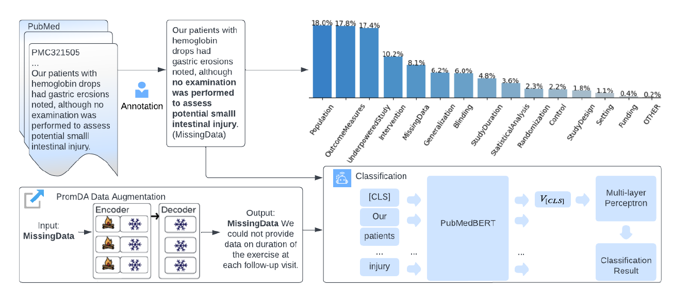

# Self-acknolwedge Kimitation Type Classification
This repository is the official implementation of [Automatic Identification of Complete Description for Self-acknowledged Limitations in Randomised Controlled Trial Articles](https://www.sciencedirect.com/science/article/pii/S1532046424000467).



## Annotation Guideline

The annotation guideline for limitation types could be found through this [link](https://drive.google.com/drive/folders/1HHPuwFVngJoKPAMwU_cbMpljBTTgkcaL?usp=sharing).

## Environment

Create a conda environment by: 
```
conda env create -f environment.yml
```
## Train Sentence Classifiers

You can run the following command to train a classifier: 

```
python main.py --input_view_augmentation_file="data/promda_input_view.txt" --output_view_augmentation_file="data/promda_output_view.txt" --bert_model="microsoft/BiomedNLP-PubMedBERT-base-uncased-abstract-fulltext" --train_set="data/train.csv" --test_set="data/test.csv" --dev_set="data/dev.csv" --fine_coarse="coarse" --target_number_augmentation=70 --augmentation_mode="PromDA output-view" --eda_augmentation_file="data/EDA_augmentation.txt" --batch_size=2 --max_length=512 --num_epochs=20 --grad_acu_steps=4 --learning_rate=1e-5 --default_threshold=0.5 --save_prediction=1 --thresholds_multi_label=True --train=True  --checkpoint="checkpoint_5/coarse_promda_output_view_1.pth" 
```

To use different augmentation mode, you can specify the augmentation mode in the "augmentation_mode" parameter (choose from EDA, Oversampling, PromDA input-view, and PromDA output-view).

## Test Sentence Classifiers

We provide the checkpoint yielded by the PromDA Output-view augmentation (best performed): [link](https://drive.google.com/drive/folders/1Rv4yhB76HLGeezWH4RUdxNcNipwRn-0k?usp=sharing). To use the checkpoint, you can download the checkpoint and the multi-thresholds file, specify the prediction target data file, then run the following command:

```
python main.py --input_view_augmentation_file="data/promda_input_view.txt" --output_view_augmentation_file="data/promda_output_view.txt" --bert_model="microsoft/BiomedNLP-PubMedBERT-base-uncased-abstract-fulltext" --test_set="limitation_identification/all_limitation_data.csv" --fine_coarse="coarse" --target_number_augmentation=70 --augmentation_mode="PromDA output-view" --eda_augmentation_file="data/EDA_augmentation.txt" --batch_size=2 --max_length=512 --num_epochs=20 --grad_acu_steps=4 --learning_rate=1e-5 --default_threshold=0.4 --checkpoint="checkpoint_5/coarse_promda_output_view_1.pth" --save_prediction=1 --thresholds_multi_label=True --from_pretrain=True
```

After running the command, a prediction file (e.g. "coarse_promda_output_view_1.csv") for the test set is created under the checkpoint folder. 
